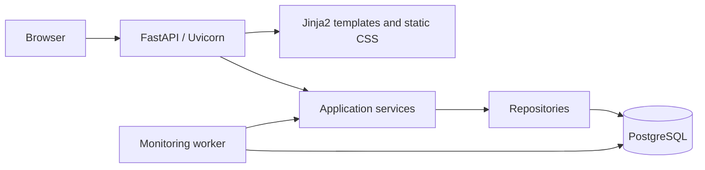
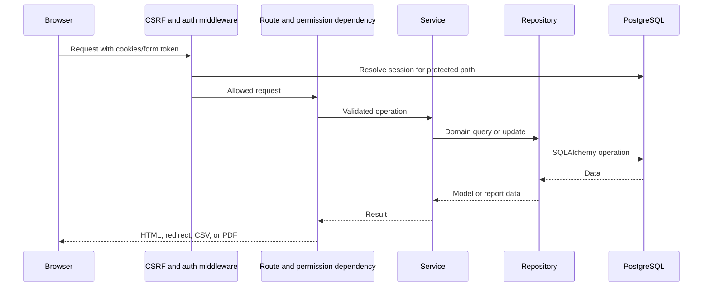
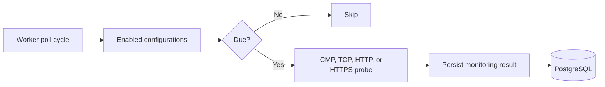

# Architecture

## Design

The platform is a server-rendered FastAPI application organized into routes, services, repositories, and SQLAlchemy models. The web process and the monitoring worker share the same `app/Dockerfile` image and database, but run different commands. PostgreSQL is the only persistent runtime dependency.

## Project structure

| Path | Responsibility |
| --- | --- |
| `app/main.py` | FastAPI setup, middleware, static files, router registration, health endpoint, and metadata-based schema creation. |
| `app/routes/` | HTTP routes for authentication, dashboard, assets, monitoring, reports, settings, and users. |
| `app/services/` | Application logic for domain operations, reports, PDF/CSV output, checks, settings, audit logging, and system information. |
| `app/repositories/` | SQLAlchemy query and persistence operations. |
| `app/models/` | SQLAlchemy mappings for assets, users and sessions, monitoring, audit logs, and settings. |
| `app/schemas/` | Pydantic input models for assets and monitoring configurations. |
| `app/templates/` and `app/static/` | Jinja2 pages, reusable template fragments, and CSS. |
| `app/workers/monitoring_worker.py` | Polling worker entry point. |
| `app/cli/create_admin.py` | Interactive initial-administrator utility. |
| `compose.yaml` / `compose.production.yaml` | Source-build and pre-built-image service definitions. |

## Request handling and layers

An incoming request passes through CSRF and authentication middleware. The authentication middleware permits `/login`, `/health`, and static files; for other paths it resolves the session cookie against the database and redirects unauthenticated users to login. It also redirects users flagged for a password change to `/change-password`.

Routes use FastAPI dependencies to acquire a database session and enforce a named permission. They render an HTML response, redirect after successful form actions, or return a download response for report exports. Route code delegates domain behavior to services. Services validate and coordinate actions, then call repositories; repositories read or commit mapped models. Templates receive the current user and permission helpers so they can conditionally render controls, while authorization remains enforced at routes.

### Authentication and authorization

`AuthService` verifies a password hash, creates a random session token, stores only its SHA-256 hash in `user_sessions`, and returns the raw token in an HTTP-only, `SameSite=Lax` cookie. Session expiration, revocation, and inactive users are checked when resolving the current user. Password hashing is delegated to `pwdlib`'s recommended configuration, with Argon2 installed through its extra.

The `require_permission` dependency maps the user's role to permissions in `app/core/constants.py`. Administrator has all defined permissions; Operator can manage assets and monitoring and view reports; Viewer has read-only dashboard, assets, monitoring, and reports access. The login throttle tracks attempts by client address in memory, and audit services write sanitized event details to the database.

### Monitoring

The worker loops at `MONITORING_SCHEDULER_POLL_SECONDS` (at least one second). Each cycle obtains enabled monitoring configurations, compares their latest result with the configuration interval, and runs only due checks. ICMP invokes the image's `ping` command; TCP uses a socket connection; HTTP and HTTPS issue a GET request. The worker writes each result to `monitoring_results` and handles individual check failures without stopping the cycle. The web route can trigger the same service for an authorized manual check.

### Reporting and settings

Report services query the same asset, monitoring, and audit data used by the portal. They produce rendered report pages, CSV streams for inventory, monitoring, and audit activity, and a ReportLab-generated executive PDF. The reporting period is resolved from request parameters and database-backed preferences, with date validation in the report-date service.

System preferences are stored in `system_settings` and are accessed through settings services and repositories. Environment-driven configuration—such as database connectivity, cookie security, authentication limits, application identity, and worker polling—is read by `app/core/config.py` and is displayed as read-only where relevant. These are separate boundaries: UI-editable settings do not rewrite process environment configuration. After table creation, the web application's startup hook invokes the idempotent default-settings initializer, which creates missing defaults without replacing existing values.

## Database initialization and persistence

Importing `app.main` imports every model and calls `Base.metadata.create_all(bind=engine)`. This creates missing mapped tables when the web application starts; it is not a migration system. The initial administrator is created separately through `python -m app.cli.create_admin`.

PostgreSQL data is persisted through the Compose named volume `postgres_data` mounted at PostgreSQL's data directory. The application uses SQLAlchemy sessions with `pool_pre_ping=True` and connects to the database service hostname `postgres` inside Compose.

## Containers and deployment

Both Compose definitions create the default Compose bridge network and attach all services to it. The web service publishes port `8088`; the source-build definition also publishes PostgreSQL only to `127.0.0.1:5432`. Service startup is ordered by PostgreSQL and web health checks, but the worker independently maintains its polling loop after startup.

| Concern | Source build: `compose.yaml` | Pre-built image: `compose.production.yaml` |
| --- | --- | --- |
| Application image | Builds `app/Dockerfile` and uses a local development tag. | Pulls the image and tag supplied by environment configuration. |
| Web and worker | Same locally built image, different commands. | Same supplied image, different commands. |
| Database | PostgreSQL 17 with `postgres_data`; loopback host port is published. | PostgreSQL 17 with `postgres_data`; no database host port is published. |
| Defaults | Development environment and non-secure cookie defaults. | Production environment and secure-cookie defaults. |

The application image is based on Python 3.12 slim, contains the `ping` utility for ICMP checks, runs as a non-root user, and exposes port 8088. Web and worker containers are read-only, use `/tmp` as `tmpfs`, drop all Linux capabilities, and set `no-new-privileges`; the worker adds `NET_RAW` for ICMP probing.

## Architectural principles and current constraints

- Separate HTTP, domain, persistence, and background-execution responsibilities while keeping a small single-application codebase.
- Store operational records, sessions, settings, and monitoring history in PostgreSQL rather than in the web process.
- Use permission checks in route dependencies, not only template visibility.
- Reuse service logic for scheduled and manually triggered monitoring.
- Keep configuration secrets and deployment values outside source control through environment files.

There is no asynchronous task queue, message broker, cache, metrics stack, reverse proxy, orchestration layer, database migration tool, or multi-node coordination in the active design. `nginx/nginx.conf` is empty and neither Compose file starts Nginx.
