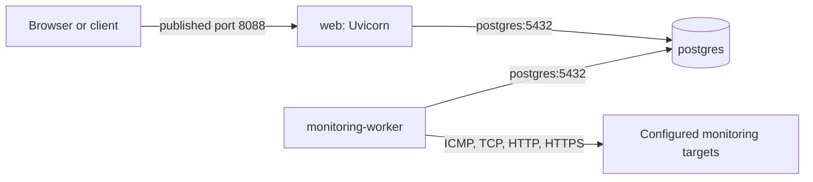

# Networking

## Runtime network

Both Compose files use Compose's default bridge network. All three services—`web`, `monitoring-worker`, and `postgres`—join that network and can resolve the database through the Compose service name `postgres`. No custom Docker network, DNS configuration, reverse proxy, or Nginx service is defined.

## Service communication

| Path | Current behavior |
| --- | --- |
| Web to PostgreSQL | The web service receives a Compose-provided `DATABASE_URL` that uses `postgres:5432`. |
| Worker to PostgreSQL | The worker uses the same internal service-name connection pattern to read configurations and write results. |
| Worker to monitored targets | The worker performs configured ICMP, TCP, HTTP, or HTTPS checks from its own container network namespace. |
| Web health check | Compose requests `http://127.0.0.1:8088/health` inside the web container. |
| PostgreSQL health check | Compose runs `pg_isready` inside the PostgreSQL container. |

The monitoring worker is therefore the source of probe traffic. A target must be reachable from the worker container, not merely from a browser or the Docker host. HTTP and HTTPS checks issue a GET request; TCP checks open a socket to the configured target and port; ICMP invokes `ping`.

## Published ports and deployment models

| Exposure | Source build: `compose.yaml` | Pre-built image: `compose.production.yaml` |
| --- | --- | --- |
| Web | Publishes container port 8088 to the configured application host port. | Publishes container port 8088 to the configured application host port. |
| PostgreSQL | Publishes `5432` only on `127.0.0.1`, allowing host-local development access. | Does not publish a PostgreSQL host port. |
| Service-to-service traffic | Uses the Compose bridge network. | Uses the Compose bridge network. |

The production definition's lack of a PostgreSQL `ports` entry prevents Compose from publishing the database to a host port. It does not replace host, cloud, or network-policy controls, none of which are configured by this repository. Similarly, the published web port is plain Uvicorn HTTP: there is no included TLS termination, reverse proxy, or production DNS design.

## ICMP and container restrictions

The image installs `iputils-ping`. Both application containers drop all Linux capabilities, but the monitoring worker explicitly adds `NET_RAW`; this exception is required for its ICMP probe implementation. The web container does not receive that exception.

Both application containers use a read-only filesystem, a `/tmp` `tmpfs`, and `no-new-privileges`. These controls do not restrict configured outbound TCP or HTTP(S) monitoring traffic. Firewall rules, inbound application access policy, target allowlists, and external exposure controls must be supplied by the deployment environment.

For container layout, see [Architecture](02-architecture.md); for security-control boundaries, see [Security](07-security.md).
